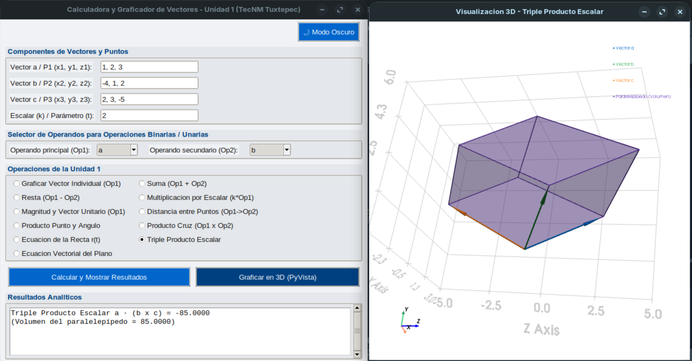

# Calculadora Interactiva de Cálculo Vectorial - Unidad 1 (TecNM)

Aplicación de escritorio desarrollada en Python diseñada para resolver, analizar y visualizar interactivamente los conceptos fundamentales de la **Unidad 1 ("Vectores en el espacio")** de la asignatura de **Cálculo Vectorial** (Clave: ACF-0904) del Tecnológico Nacional de México (TecNM).

---
## 🖼️ Vista Previa de la Aplicación

<p align="center">
  
</p>

## 🚀 Características Principales

- **Interfaz Gráfica Adaptativa:** Selector dinámico de modo oscuro y modo claro mediante un botón de alternancia.
- **Entrada Dinámica:** Configuración flexible de hasta tres vectores o puntos en $\mathbb{R}^3$ ($a, b, c$) y parámetros escalares ($k, t$).
- **Motor Analítico Robusto:** Operaciones algebraicas exactas y de alta velocidad impulsadas por **NumPy**.
- **Visualización 3D Interactiva:** Renderizado gráfico tridimensional en tiempo real utilizando **PyVista** (ejes coordenados, rejillas adaptativas, flechas vectoriales de grosor constante, mallas y superficies transparentes).
- **Consola de Resultados Integrada:** Historial detallado con barra de desplazamiento para consultar los valores analíticos devueltos.

---

## 📐 Operaciones Soportadas (Temario Unidad 1 TecNM)

| Operación / Concepto | Descripción Geométrica y Analítica |
| :--- | :--- |
| **Graficación de Vectores** | Representación espacial desde el origen con cálculo de magnitud, vector unitario y ángulos/cosenos directores ($\alpha, \beta, \gamma$). |
| **Suma y Resta Vectorial** | Visualización geométrica de la ley del triángulo y paralelogramo para operaciones binarias. |
| **Multiplicación por Escalar** | Ilustración del escalamiento, compresión e inversión de dirección de un vector en el espacio. |
| **Magnitud y Vector Unitario** | Cálculo de la norma de una entidad espacial y normalización de su dirección. |
| **Distancia entre Puntos** | Trazado de segmentos tubulares y esferas delimitadoras entre dos posiciones espaciales ($P_1 \rightarrow P_2$). |
| **Producto Punto y Ángulo** | Cálculo del producto escalar, ángulo analítico (radianes y grados) y representación de la proyección vectorial. |
| **Producto Cruz** | Generación del vector ortogonal resultante en $\mathbb{R}^3$ y su magnitud asociada. |
| **Ecuación de la Recta** | Modelado paramétrico de líneas rectas en el espacio a partir de un punto inicial y un vector director. |
| **Triple Producto Escalar** | Cálculo del volumen escalar y renderizado volumétrico transparente del paralelepípedo formado por tres vectores. |
| **Ecuación Vectorial del Plano** | Determinación de puntos base, vectores directores, vector normal ($n = u \times v$), ecuación general ($Ax + By + Cz = D$) y superficie mallada en 3D. |

---

## 💻 Requisitos del Sistema

- **Python** 3.8 o superior.
- Librerías principales:
  - `numpy`
  - `pyvista`
  - `tkinter` (incluida por defecto en la mayoría de instalaciones de Python en Linux/Windows).

---

## 🛠️ Instalación y Ejecución

Clona el repositorio e instala las dependencias necesarias ejecutando los siguientes comandos en tu terminal:

```bash
# Clonar el repositorio
git clone [https://github.com/tu-usuario/calculadora-vectorial-tecnm.git](https://github.com/tu-usuario/calculadora-vectorial-tecnm.git)
cd calculadora-vectorial-tecnm

# Instalar dependencias requeridas
pip install numpy pyvista

# Ejecutar la aplicación
python main.py
